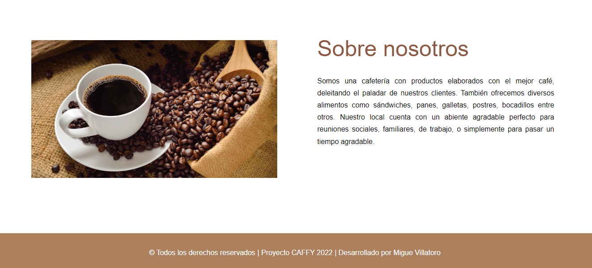

# CAFFY ☕

### Descripción:
Es un sitio web donde puedes encontrar información acerca de la cafetería CAFFY.

### Lenguajes utilizados:

✅ HTML5 (Lenguaje de estructura)

✅ CSS3 (Lenguaje de estilos)

### Enlace:

https://miguevillatoro.github.io/caffy-project/

